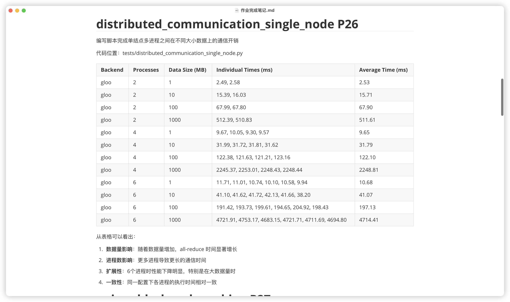
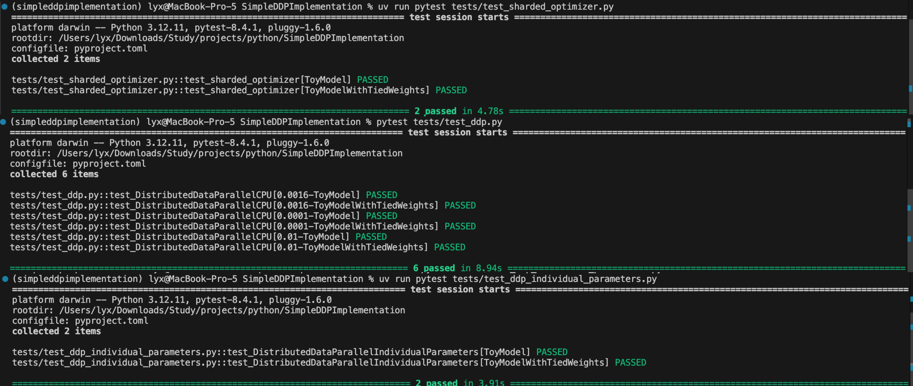
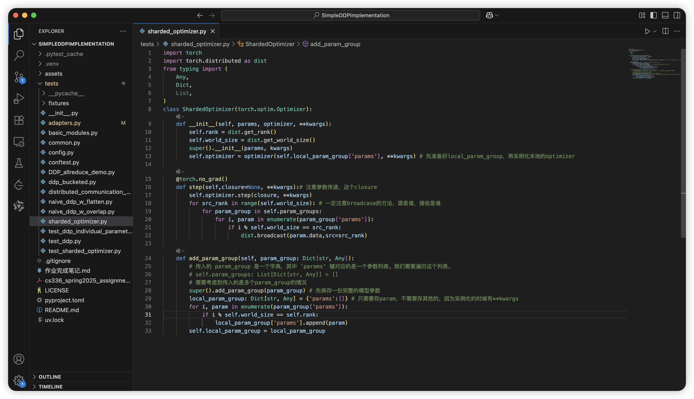

# SimpleDDPImplementation

随着深度学习模型规模的爆炸式增长，分布式训练已经从可选项变为必需品。无论是使用PyTorch的DDP技术、DeepSpeed的ZeRO优化，还是集成度更高的大模型训练框架（如LlamaFactory+DeepSpeed、Megatron+DeepSpeed），分布式训练都是现代AI工程师必须掌握的核心技能。然而，许多开发者虽然会使用这些工具，却对其底层实现原理缺乏深入理解，导致在遇到性能瓶颈或调试复杂Bug时束手无策。

本项目基于斯坦福CS336课程的Assignment2，通过**从零实现**的方式深度剖析DDP分布式训练和Sharded Optimizer的核心机制。我们从最基础的PyTorch多进程通信开始，逐步构建完整的分布式训练系统：首先掌握all_reduce集合通信原理，然后通过性能基准测试量化通信开销，接着手工实现DDP并进行多轮优化（梯度扁平化、异步通信重叠、分桶优化），最后实现ZeRO Stage 1的优化器状态分片技术。整个学习路径既有理论深度，又有工程实践，帮助读者真正理解分布式训练的精髓。

如果你觉得本项目对你有帮助，欢迎给出你的Github Star🌟，也欢迎对本人的代码批评指正，提出Github Issue / Github PR : )

**注意**：请充分结合本人的[作业完成笔记](作业完成笔记.md)和[官方的作业指导书](cs336_spring2025_assignment2_systems.pdf)使用本项目。







## 项目概述

本项目通过循序渐进的方式，深入探索分布式深度学习训练的核心技术，从基础的多进程通信到高级的优化器状态分片，涵盖了DDP（Distributed Data Parallel）技术栈的完整实现和优化过程。

### 核心技术栈

#### 1. 分布式通信基础
- **基础 All-Reduce 实现** (`tests/DDP_allreduce_demo.py`)：掌握PyTorch分布式训练的基本概念，理解进程组、后端选择（gloo/nccl）和集合通信操作
- **通信性能基准测试** (`tests/distributed_communication_single_node.py`)：深入分析不同数据规模和进程数量下的通信开销，为后续优化提供量化依据

#### 2. 朴素DDP实现与优化
- **手工DDP实现** (`tests/naive_ddp_w_flatten.py`)：不依赖PyTorch DDP模块，从零实现分布式数据并行训练，包括参数同步和梯度聚合
- **梯度扁平化优化**：通过 `torch._utils._flatten_dense_tensors` 减少通信次数，将多个小张量合并为单个大张量进行传输
- **性能对比分析**：在真实大模型（0.423B参数）上验证优化效果

#### 3. 高级通信优化技术
- **计算通信重叠** (`tests/naive_ddp_w_overlap.py`)：实现异步梯度通信，使用 `register_post_accumulate_grad_hook` 在梯度就绪时立即启动通信，显著提升训练效率（14%加速）
- **分桶异步通信** (`tests/ddp_bucketed.py`)：结合梯度分桶和异步通信，在保证通信效率的同时减少内存碎片

#### 4. 内存优化与ZeRO实现
- **优化器状态分片** (`tests/sharded_optimizer.py`)：手工实现ZeRO Stage 1技术，将优化器状态（如AdamW的momentum和variance）在多个设备间分片存储，大幅减少显存占用
- **参数广播同步**：实现分片优化器的参数同步机制，确保训练一致性

#### 5. 多维并行架构简介
项目理论涵盖现代大模型训练的4D并行策略：
- **数据并行（DP）**：批次数据分片
- **全分片数据并行（FSDP）+ 张量并行（TP）**：参数和激活分片
- **流水线并行（PP）**：模型层级分片
- **专家并行（EP）**：MoE模型的专家分片

### 技术特色

1. **渐进式学习路径**：从最基础的多进程通信开始，逐步深入到高级优化技术
2. **性能基准驱动**：每个优化都有详细的性能测试和分析
3. **实战导向**：在真实规模的Transformer模型上验证技术效果
4. **深度解析**：不仅实现功能，更深入理解GPU异步执行、CUDA流同步等底层机制
5. **完整测试覆盖**：提供完整的单元测试和集成测试，确保实现正确性

### 项目价值

- **教育价值**：为深度学习研究者提供分布式训练技术的完整学习路径
- **实用价值**：可作为生产环境分布式训练系统的参考实现
- **研究价值**：为分布式训练算法研究提供可扩展的实验平台

## 项目代码框架

```
SimpleDDPImplementation/
├── README.md                              # 项目文档和使用指南
├── 作业完成笔记.md                         # 详细的实现记录和技术分析
├── cs336_spring2025_assignment2_systems.pdf # 原始作业指导书
├── pyproject.toml                          # 项目配置和依赖管理
├── uv.lock                                # 锁定的依赖版本
├── assets/                                # 文档图片资源
├── tests/                                 # 核心实现和测试代码
│   ├── conftest.py                        # pytest配置和共享fixture
│   ├── config.py                          # 全局配置参数
│   │
│   ├── 基础模块
│   │   ├── basic_modules.py                  # 基础神经网络模块和工具
│   │   ├── common.py                         # 通用测试工具和模型定义
│   │   └── adapters.py                       # 不同DDP实现的适配器接口
│   │
│   ├── 分布式通信基础
│   │   ├── DDP_allreduce_demo.py            # All-Reduce基础演示
│   │   └── distributed_communication_single_node.py # 通信性能基准测试
│   │
│   ├── DDP核心实现
│   │   ├── naive_ddp_w_flatten.py           # 朴素DDP + 梯度扁平化
│   │   ├── naive_ddp_w_overlap.py           # 异步通信重叠优化
│   │   └── ddp_bucketed.py                  # 分桶异步DDP实现
│   │
│   ├── 内存优化
│   │   └── sharded_optimizer.py             # ZeRO Stage 1优化器分片
│   │
│   └── 测试套件
│       ├── test_ddp.py                      # DDP分桶测试
│       ├── test_ddp_individual_parameters.py # 单参数DDP测试
│       └── test_sharded_optimizer.py        # 分片优化器测试
└── fixtures/                              # 测试数据
    ├── ddp_test_data.pt                     # 测试输入数据
    └── ddp_test_labels.pt                   # 测试标签数据
```

## 使用说明

- 推荐使用uv管理项目环境
```bash
cd SimpleDDPImplementation
uv sync
source .venv/bin/activate
```

⚠️ Academic Honesty Notice  
This repository contains my solutions to assignments for CS336 (2025).  
It is shared **for educational and reference purposes only**.

- ✅ You are welcome to:  
  - Study the code to understand concepts  
  - Run experiments locally  
  - Cite this work (with attribution)  

- ❌ Please do **NOT**:  
  - Submit this code (or minor modifications) as your own coursework  
  - Use it to violate your institution's academic integrity policy  

If you're taking CS336 (or similar), try solving problems yourself first — you’ll learn more! 😊
