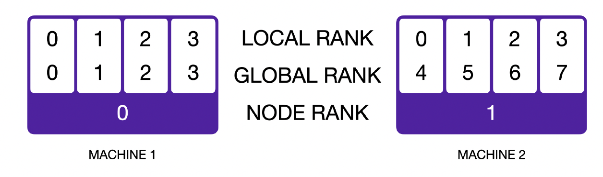

# 说明

本文件为完成cs336_assignment2的与benchmarking和triton相关的实现，每一个一组标题对应一个[官方作业指导说明书](./cs336_spring2025_assignment2_systems.pdf)中的一个需要自己实现的部分。每个部分的要求以及相关指导在指导书中有详细描述。如果涉及到相关代码，在每个一组标题下会单独标注在项目中的代码位置。

**举例** 以benchmarking_script为例，对应说明书中P3中的图示部分，代码位置是在


# 1 Benchmarking and Flash Attention

# benchmarking_script P3

代码位置：tests/benchmarking_script.py

run on 4090D autodl platform

| 模型规模 | 参数量    | d_model | d_ff | num_layers | num_heads | 可训练参数量 (B) | 前向传播时间 (s) | 前向+反向时间 (s) | 纯反向时间 (估算, s) |
| :------- | --------- | :------ | ---- | ---------- | --------- | ---------------- | ---------------- | ----------------- | -------------------- |
| small    | 0.128625B | 768     | 3072 | 12         | 12        | 0.128625         | 0.032844         | 0.050388          | 0.0175               |
| medium   | 0.423183B | 1024    | 4096 | 24         | 16        | 0.423183         | 0.046657         | 0.093223          | 0.0466               |
| large    | 0.969412B | 1280    | 5120 | 36         | 20        | 0.969412         | 0.072001         | 0.118849          | 0.0468               |

# nsys_profile  P5

代码位置：tests/benchmarking_script.py

运行方式：nsys profile -o result python tests/benchmarking_script.py

主要学习nsight system的基本使用，包括用nvtx标注感兴趣代码位置，用nsys收集数据，用nsight system打开，察看耗时等等

(a) 在cpu上的前向传播和反向传播的nvtx标记和timeit测试出来的基本一致

(b)在单次前向传播过程中，调用次数最多的是ampere_sgemm_...这个矩阵乘法kernel，一次前向传播调用了85次（small size），如果包含前向和反向传播，也是这个kernel执行次数最多，次数也是85次


(c)除了矩阵乘法之后，elementwise_kernel也占了不少的计算，例如加法、乘法、ReLU、Sigmoid 等。这种 kernel 在深度学习中大量出现，因为很多激活函数、loss 函数、张量变换都属于逐元素操作。

(d)测试一轮完整的前向传播+反向传播+优化器更新，占比最多的还是矩阵乘法，但是占比稍微下降，因为优化器更新中有大量的逐元素的更新操作，相比仅前向传播的66.4%占比下降到47.3%


(e)测试一次前向传播中一个attention中的矩阵乘法和softmax的时间消耗之比和两者FLOPS之比，观察是否有什么现象。

computing attention scores:

​	time: 350us

​	FLOPS: 8 * 12 * 256 * 64 * 256 * 2 + 8 * 12 * 256 * 256 = 811,597,824

computing softmax: 

​	time: 161us

​	FLOPS: 8   ×   12   ×   256   ×   256   ×   3 = 18,874,368

final matmul: 

​	time: 350us

​	FLOPS: 8 * 12 * 256 * 64 * 256 * 2 = 805,306,368

final matmul和computing softmax的FLOPS比例：42.7

final matmul和computing softmax的Time比例：2.2


**结论：虽然 softmax 的 FLOPS 很小，但由于其 memory-bound、本身结构复杂、指令混合率差，导致执行时间并不成比例地小。相比之下，GEMM 虽然 FLOPS 巨大，但因为其是 compute-bound 且高度优化，反而执行时间较短或与 softmax 相近。**

## nvtx用法(import torch.cuda.nvtx as nvtx)

**用法1：使用装饰器**

​	在一个函数前面加上@nvtx.range("")可以将这个函数标注为nvtx范围

**用法2：with语法**

​	在需要标注的代码块前面上使用with nvtx.range("")

**用法3：push & pop**

​	在合适的地方使用nvtx.range_push("")和nvtx.range_pop()

```python
# 用法1,2代码示例
@nvtx.range("scaled dot product attention")
def annotated_scaled_dot_product_attention(q, k, v, mask=None, softmax=torch.softmax):
    # q: ([8, 12, 256, 64]), k: ([8, 12, 256, 64]), v: ([8, 12, 256, 64])
    d_k = q.shape[-1]
    with nvtx.range("computing attention scores"):
        attention = q @ k.transpose(-1,-2) / d_k ** 0.5
    if mask is not None:
        attention = attention.masked_fill(~mask, float('-inf'))
    with nvtx.range("computing softmax"):
        result = softmax(attention,dim=-1)
    with nvtx.range("final matmul"):
        result = result @ v
    return result

# 用法3代码示例
# 测试前向传播时间 (重复10次取平均)
forward_pass_time = []
for i in range(15):
    # 使用NVTX标记预热和测试阶段
    if i > 5:
        nvtx.range_push(f"forward_pass_test_{i}")
        forward_pass_time.append(timeit.timeit(forward_pass_only, number=1))
        nvtx.range_pop()
    else:
        nvtx.range_push(f"forward_pass_warmup_{i}")
        timeit.timeit(forward_pass_only, number=1)
        nvtx.range_pop()
        forward_pass_time = np.array(forward_pass_time)
```

**注意：同一个代码范围内如果有多个nvtx标注，在nsight system中则会显示为重叠的nvtx，是正常情况**

# mixed_precision_accumulation  P6

代码位置：tests/mixed_presicion_accumulations.py

```python
import torch
s = torch.tensor(0,dtype=torch.float32)
for i in range(1000):
    s += torch.tensor(0.01,dtype=torch.float32)
print(s)
s = torch.tensor(0,dtype=torch.float16)
for i in range(1000):
    s += torch.tensor(0.01,dtype=torch.float16)
print(s)
s = torch.tensor(0,dtype=torch.float32)
for i in range(1000):
    s += torch.tensor(0.01,dtype=torch.float16)
print(s)
s = torch.tensor(0,dtype=torch.float32)
for i in range(1000):
    x = torch.tensor(0.01,dtype=torch.float16)
    s += x.type(torch.float32)
print(s)
```

代码运行结果：

```BASH
tensor(10.0001)
tensor(9.9531, dtype=torch.float16)
tensor(10.0021)
tensor(10.0021)
```

说明在累加时低精度会导入累加误差较大，累加过程需要使用高精度

# benchmarking_mixed_precision  P7

代码位置：tests/benchmarking_script.py

全精度：

前向传播平均时间: 0.148052 秒
前向+反向传播时间: 0.439438 秒
纯反向传播时间(估算): 0.2914 秒
完整一步更新时间: 0.5072 秒

混合精度：

前向传播平均时间: 0.077418 秒
前向+反向传播时间: 0.208083 秒
纯反向传播时间(估算): 0.1307 秒
完整一步更新时间: 0.2676 秒

(a)不同层在autocast中是否会被下降精度到fp16

模型参数（model parameters）：

- **数据类型：FP32**
- **原因：** PyTorch 默认在混合精度训练中保留参数为 FP32，以避免梯度更新时的数值不稳定。

第一层线性层输出（`self.fc1(x)` 的输出）：

- **数据类型：FP16**
- **原因：** 线性层是计算密集型操作，`autocast` 会将其输入和输出自动转换为 FP16 来加速计算。

LayerNorm 层的输出（`self.ln(x)` 的输出）：

- **数据类型：FP32**
- **原因：** `LayerNorm` 对数值稳定性要求高，`autocast` 默认将其保持在 FP32。

模型最终输出 / logits（`self.fc2(x)` 的输出）：

- **数据类型：FP16**
- **原因：** `fc2` 是线性层，处于 `autocast` 范围内，因此其输出为 FP16。

Loss 值：

- **数据类型：FP32**
- **原因：** 为了数值稳定性，loss 计算通常在 FP32 中进行。比如 `nn.CrossEntropyLoss` 在混合精度时也会保留 FP32。

模型参数的梯度（gradients）：

- **数据类型：FP32**
- **原因：** 即使前向和部分反向计算使用 FP16，梯度仍然会累积到 FP32 参数上，因此是 FP32。若使用 `GradScaler`，它也会在更新权重前自动将梯度 unscale。

(b)为什么layer norm会保持FP32

layer norm需要计算方差，均值，对数值敏感，而fp16动态范围小，所以保持fp32。如果使用BF16，动态范围较大，就可以使用。

# memory_profiling  P8

代码位置：tests/benchmarking_script.py

用torch.cuda.memory._record_memory_history(*max_entries*=1000000)来记录模型运行时显存使用情况

(a)分别测试仅前向传播和一步完整的更新

全精度


混合精度


(b)内存峰值是什么？

先上升后下降是因为计算图是逐渐构建的过程，在前向传播过程中，计算到的变量会逐渐加入计算图，占用显存资源，使用完之后中间变量会逐渐被释放。完整一步的显存占用比仅前向传播多是因为backward操作本身也会创建一些变量占用内存，下降之后保持在2G左右，推测是因为pytorch并不会直接将释放的显存归还显卡，而是缓存一部分供后续使用。

(c)如上图，在仅前向传播中，混合精度峰值显存占用从3.8G下降到2.9G

(e)调节detail这一项，占用显存最多的是哪个部分，这个暂时还不太会看，不过显示的很多都是basic_modules.py中的一个forward函数，大小都是24MB左右，如果是看单个最大的话，峰值处的计算cross entropy loss分配了78MB，是最大的，不太确定是不是这个意思。

# pytorch_attention P9

代码位置：tests/benchmarking_attention.py

测试普通的attention在不同数据规模下的耗时

| d_model | seq_len | Forward (100 passes) | Backward (100 passes) | Memory Reserved (MB) | Memory Allocated (MB) |
| ------: | ------: | -------------------: | --------------------: | -------------------: | --------------------: |
|      16 |     256 |             24.51 ms |             261.76 ms |                42.00 |                 16.61 |
|      16 |    1024 |             21.82 ms |             270.60 ms |                42.00 |                 20.69 |
|      16 |    4096 |             48.60 ms |             273.90 ms |               300.00 |                 82.00 |
|      16 |    8192 |            184.29 ms |             560.51 ms |              1070.00 |                275.75 |
|      16 |   16384 |            722.16 ms |            2187.56 ms |              4146.00 |               1047.25 |
|      32 |     256 |             10.10 ms |             128.82 ms |                42.00 |                 16.72 |
|      32 |    1024 |             17.04 ms |             267.64 ms |                42.00 |                 21.12 |
|      32 |    4096 |             49.20 ms |             280.78 ms |               302.00 |                 83.75 |
|      32 |    8192 |            184.55 ms |             558.59 ms |              1074.00 |                279.25 |
|      32 |   16384 |            724.53 ms |            2199.53 ms |              4138.00 |               1054.25 |
|      64 |     256 |              9.47 ms |             249.61 ms |                42.00 |                 16.94 |
|      64 |    1024 |             21.84 ms |             272.26 ms |                44.00 |                 22.00 |
|      64 |    4096 |             53.39 ms |             260.70 ms |               306.00 |                 87.25 |
|      64 |    8192 |            186.33 ms |             566.47 ms |              1066.00 |                286.25 |
|      64 |   16384 |            733.14 ms |            2222.08 ms |              5162.00 |               1068.25 |
|     128 |     256 |              9.55 ms |             254.73 ms |                44.00 |                 17.38 |
|     128 |    1024 |             21.59 ms |             238.18 ms |                46.00 |                 23.75 |
|     128 |    4096 |             58.46 ms |             240.90 ms |               298.00 |                 94.25 |
|     128 |    8192 |            209.19 ms |             621.89 ms |              1322.00 |                300.25 |
|     128 |   16384 |            812.43 ms |            2389.41 ms |              5222.00 |               1096.25 |

重点观察：

- 时间消耗与seq_len成平方比，dim增加对时间消耗影响不是很大

# torch_compile  P10

代码位置：tests/benchmarking_script.py

使用torch.compile(model)进行模型优化，测试速度明显变快，reserved memory也变少了

| d_model | seq_len | Forward (100 passes) | Backward (100 passes) | Memory Reserved (MB) | Memory Allocated (MB) |
| ------- | ------- | -------------------- | --------------------- | -------------------- | --------------------- |
| 16      | 256     | 30.82 ms             | 174.83 ms             | 42.00                | 16.61                 |
| 16      | 1024    | 47.57 ms             | 150.77 ms             | 42.00                | 20.69                 |
| 16      | 4096    | 49.39 ms             | 138.51 ms             | 172.00               | 82.00                 |
| 16      | 8192    | 181.71 ms            | 454.73 ms             | 558.00               | 275.75                |
| 16      | 16384   | 729.02 ms            | 1816.57 ms            | 2100.00              | 1047.25               |
| 32      | 256     | 32.54 ms             | 183.81 ms             | 42.00                | 16.72                 |
| 32      | 1024    | 47.78 ms             | 239.37 ms             | 42.00                | 21.12                 |
| 32      | 4096    | 54.55 ms             | 242.00 ms             | 174.00               | 83.75                 |
| 32      | 8192    | 182.55 ms            | 453.81 ms             | 564.00               | 279.25                |
| 32      | 16384   | 732.16 ms            | 1831.38 ms            | 2090.00              | 1054.25               |
| 64      | 256     | 12.92 ms             | 166.24 ms             | 42.00                | 16.94                 |
| 64      | 1024    | 45.53 ms             | 192.59 ms             | 44.00                | 22.00                 |
| 64      | 4096    | 58.76 ms             | 228.85 ms             | 180.00               | 87.25                 |
| 64      | 8192    | 182.28 ms            | 460.96 ms             | 554.00               | 286.25                |
| 64      | 16384   | 741.55 ms            | 1859.79 ms            | 2110.00              | 1068.25               |
| 128     | 256     | 33.09 ms             | 185.82 ms             | 42.00                | 17.38                 |
| 128     | 1024    | 49.94 ms             | 333.33 ms             | 46.00                | 23.75                 |
| 128     | 4096    | 67.42 ms             | 356.57 ms             | 170.00               | 94.25                 |
| 128     | 8192    | 208.49 ms            | 551.05 ms             | 574.00               | 300.25                |
| 128     | 16384   | 827.16 ms            | 2050.30 ms            | 3174.00              | 1096.25               |

# Flash attention学习笔记

[推荐观看b站视频](https://www.bilibili.com/video/BV1UT421k7rA/?spm_id_from=333.1391.0.0&vd_source=cacd898e44cd6114d93337514538a038)
并且结合指导书P18，和P23中的算法伪代码来学习。

# flash_forward P19

代码位置：tests/flash_attention_modules.py

(a)用pytorch实现flash attention2的操作

理解flash attention的操作之后再写代码就不困难了，写好之后可以先与普通的attention操作进行简单对比

```python
  seq_len_list = [256, 1024, 4096, 8192, 16384]
  for _ in range(5):
      self_attention(torch.rand(1, 4096, 64),torch.rand(1, 4096, 64),torch.rand(1, 4096, 64))
  Q = torch.rand(8, 16384, 64)
  K = torch.rand(8, 16384, 64)
  V = torch.rand(8, 16384, 64)
  attention_pt = self_attention(Q, K, V)
  attention_flash = apply_flash_atn_pt(Q, K, V)
  assert torch.allclose(attention_flash, attention_pt, rtol=1e-5)
  for seq_len in seq_len_list:
      Q = torch.rand(8, seq_len, 64)
      K = torch.rand(8, seq_len, 64)
      V = torch.rand(8, seq_len, 64)
      pytorch_time = timeit.timeit(lambda: self_attention(Q, K, V), number=1)
      flash_time = timeit.timeit(lambda: apply_flash_atn_pt(Q, K, V), number=1)
      print(f"Seq_len: {seq_len}, PyTorch time: {pytorch_time:.4f}s, Flash time: {flash_time:.4f}s")
```

运行结果如下：

```bash
Seq_len: 256, PyTorch time: 0.0002s, Flash time: 0.0018s
Seq_len: 1024, PyTorch time: 0.0002s, Flash time: 0.0130s
Seq_len: 4096, PyTorch time: 0.0002s, Flash time: 0.1810s
Seq_len: 8192, PyTorch time: 0.0002s, Flash time: 0.6894s
Seq_len: 16384, PyTorch time: 0.0956s, Flash time: 2.7439s
```

发现flash attention的pytorch版本比pytorch本身的实现慢很多，因为有很多IO加载和更多的变量操作，这是符合常理的。

(b)用triton实现flash attention的forward pass

**这里需要特别注意，triton中的D维度必须要是2的幂次方，如果不是的话需要补充到2的幂次方去才不报错**

(c)实现forward pass 中的causal mask

使用block所在的行号数和列号数大小数据进行比较，从而生成causal mask

# flash_benchmarking P21

代码位置：tests/benchmarking_attention.py

在用triton实现了前向传播的基础上，使用flash attention中的recomputation实现backward pass，再用triton实现backward，实现flash attention的完整triton算子

下表是backward由pytorch实现，因为测试时出现了无法解决的Error: CUDA error: an illegal memory access was encountered错误，分析之后发现在d_model, seq_len较大的时候会出现这个错误，应该是shared_memory不够导致的这个问题。

前向传播相比torch.compile的普通attention明显又更快了

| d_model | seq_len | Forward (100 passes) | Backward (100 passes) | Memory Reserved (MB) | Memory Allocated (MB) |
| ------- | ------- | -------------------- | --------------------- | -------------------- | --------------------- |
| 16      | 256     | 45.51 ms             | 239.99 ms             | 514.00               | 8.24                  |
| 16      | 1024    | 42.83 ms             | 200.35 ms             | 258.00               | 8.57                  |
| 16      | 4096    | 43.00 ms             | 249.05 ms             | 260.00               | 9.89                  |
| 16      | 8192    | 49.84 ms             | 444.79 ms             | 774.00               | 11.66                 |
| 16      | 16384   | 78.75 ms             | 1271.49 ms            | 2316.00              | 15.19                 |
| 32      | 256     | 46.89 ms             | 346.37 ms             | 514.00               | 8.34                  |
| 32      | 1024    | 46.73 ms             | 353.93 ms             | 258.00               | 9.00                  |
| 32      | 4096    | 45.52 ms             | 272.81 ms             | 262.00               | 11.64                 |
| 32      | 8192    | 65.16 ms             | 512.55 ms             | 780.00               | 15.16                 |
| 32      | 16384   | 129.41 ms            | 1277.86 ms            | 2306.00              | 22.19                 |
| 64      | 256     | 46.93 ms             | 255.32 ms             | 514.00               | 8.56                  |
| 64      | 1024    | 43.84 ms             | 354.39 ms             | 260.00               | 9.88                  |
| 64      | 4096    | 47.12 ms             | 357.17 ms             | 268.00               | 15.14                 |
| 64      | 8192    | 69.88 ms             | 516.41 ms             | 770.00               | 22.16                 |
| 64      | 16384   | 162.28 ms            | 1308.70 ms            | 2306.00              | 36.19                 |
| 128     | 256     | 41.97 ms             | 163.51 ms             | 514.00               | 9.00                  |
| 128     | 1024    | 42.99 ms             | 350.12 ms             | 262.00               | 11.63                 |
| 128     | 4096    | 69.29 ms             | 344.14 ms             | 258.00               | 22.14                 |
| 128     | 8192    | 143.78 ms            | 556.24 ms             | 770.00               | 36.16                 |
| 128     | 16384   | 428.89 ms            | 1722.82 ms            | 2306.00              | 64.19                 |


# 补充任务

将triton实现的flash attention替换完整大模型中的attention来测试加速效果

代码位置：tests/benchmarking_script.py

测试数据输入维度：(1,1024)

| 模型规模 | d_model | d_ff  | num_layers | num_heads |
| -------- | ------- | ----- | ---------- | --------- |
| small    | 768     | 3072  | 12         | 12        |
| medium   | 1024    | 4096  | 24         | 16        |
| large    | 1280    | 5120  | 36         | 20        |
| xl       | 1600    | 6400  | 48         | 25        |
| 2.7B     | 2560    | 10240 | 32         | 32        |

| Model Size | Params (B) | 实现方式 | 前向传播 (s) | 前+反向 (s) | 反向传播 (估算, s) | 前向加速比 | 前+反向加速比 | 备注           |
| ---------- | ---------- | -------- | ------------ | ----------- | ------------------ | ---------- | ------------- | -------------- |
| small      | 0.129      | 普通     | 0.0551       | 0.0853      | 0.0302             | —          | —             | ✅ 成功         |
|            |            | Triton   | 0.0371       | 0.0645      | 0.0275             | **1.49×**  | **1.32×**     | ✅ 成功         |
| medium     | 0.423      | 普通     | 0.1114       | 0.2280      | 0.1165             | —          | —             | ✅ 成功         |
|            |            | Triton   | 0.0799       | 0.1444      | 0.0645             | **1.40×**  | **1.58×**     | ✅ 成功         |
| large      | 0.969      | 普通     | 0.2100       | 0.4437      | 0.2337             | —          | —             | ✅ 成功         |
|            |            | Triton   | 0.1511       | 0.2767      | 0.1256             | **1.39×**  | **1.60×**     | ✅ 成功         |
| xl         | 1.998      | 普通     | —            | —           | —                  | —          | —             | ❌ OOM (23.5GB) |
|            |            | Triton   | 0.2866       | 0.5067      | 0.2200             | —          | —             | ✅ 成功         |
| 2.7B       | 3.407      | 普通     | —            | —           | —                  | —          | —             | ❌ OOM (23.5GB) |
|            |            | Triton   | —            | —           | —                  | —          | —             | ❌ OOM (23.5GB) |

# 后续工作

- 深入理解triton block和GPU硬件SM等之间的关系，理解如何动态根据GPU型号，数据大小，模型大小来调整triton block的Tile size，以及最大化使用GPU性能
- 目前只对self attention进行了triton算子加速，但是其他的地方比如FFN中的大量的矩阵乘法没有写算子，后续可以继续优化。

# 遇到的一些问题

- illegal memory access

通常是在triton内核中的block维度出现错误，比如传入的stride和张量指针大小之间不匹配等等问题

后来再flash_benchmarking中，使用triton实现的backward中，当维度较大，seq_len较长的时候也会出现这个错误，这个情况下猜测可能是shared_memory(SRAM)空间不够导致的

- 维度问题

在triton内核中，element shape应该是2的幂次方，如果不是的话需要padding到最小的2的次方来保证正常运行

- out of resource: shared memory, Required: 328832, Hardware limit: 101376. Reducing block sizes or `num_stages` may help.

在写triton的时候需要设置tile_size，如果设置的太大则在SRAM中使用的空间就会超过上限出现这个错误，所以需要动态灵活调整tile_size

# 学习笔记


# 2 Distributed Data Parallel Training

# DDP_allreduce_demo P24

如果是在多GPU训练中，需要保证不同的进程使用不同的GPU。
方法1: 使用torch.cuda.set_device(rank)，然后再使用tensor.to("cuda")的时候就会自动放到指定的GPU上
方法2: 使用device = f"cuda:{rank}"然后使用tensor.to(device)即可



# distributed_communication_single_node

| Backend | Processes | Data Size (MB) | Individual Times (ms)                                | Average Time (ms) |
| ------- | --------- | -------------- | ---------------------------------------------------- | ----------------- |
| gloo    | 2         | 1              | 2.49, 2.58                                           | 2.53              |
| gloo    | 2         | 10             | 15.39, 16.03                                         | 15.71             |
| gloo    | 2         | 100            | 67.99, 67.80                                         | 67.90             |
| gloo    | 2         | 1000           | 512.39, 510.83                                       | 511.61            |
| gloo    | 4         | 1              | 9.67, 10.05, 9.30, 9.57                              | 9.65              |
| gloo    | 4         | 10             | 31.99, 31.72, 31.81, 31.62                           | 31.79             |
| gloo    | 4         | 100            | 122.38, 121.63, 121.21, 123.16                       | 122.10            |
| gloo    | 4         | 1000           | 2245.37, 2253.01, 2248.43, 2248.44                   | 2248.81           |
| gloo    | 6         | 1              | 11.71, 11.01, 10.74, 10.10, 10.58, 9.94              | 10.68             |
| gloo    | 6         | 10             | 41.10, 41.62, 41.72, 42.13, 41.66, 38.20             | 41.07             |
| gloo    | 6         | 100            | 191.42, 193.73, 199.61, 194.65, 204.92, 198.43       | 197.13            |
| gloo    | 6         | 1000           | 4721.91, 4753.17, 4683.15, 4721.71, 4711.69, 4694.80 | 4714.41           |

从表格可以看出：

1. **数据量影响**：随着数据量增加，all-reduce 时间显著增长
2. **进程数影响**：更多进程导致更长的通信时间
3. **扩展性**：6个进程时性能下降明显，特别是在大数据量时
4. **一致性**：同一配置下各进程的执行时间相对一致

# naive_ddp_benchmarking

写一个最简单的双卡训练数据并行，不使用DDP模块，直接手动实现数据reduce操作，在两张4090D的运行一个toymodel,结果如下：
average full time: 0.0030654694080352782
average sync time: 0.0021082186698913575

可以看到同步的模块花了将近2/3的时间，所以手动实现显卡之间数据reduce开销比较大，需要优化。
