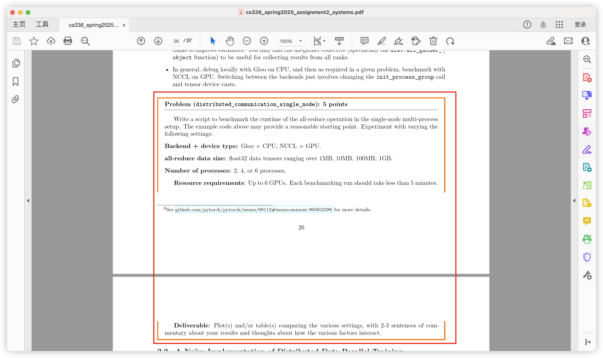
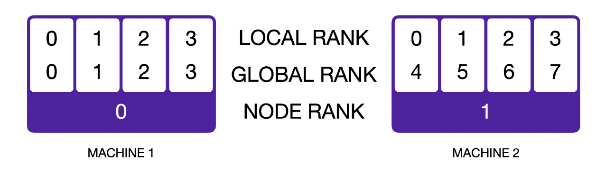

# 说明

本文件为完成cs336_assignment2的与DDP分布式训练和Sharded Optimizer相关的实现，每一个一组标题对应一个[官方作业指导说明书](./cs336_spring2025_assignment2_systems.pdf)中的一个需要自己实现的部分。每个部分的要求以及相关指导在指导书中有详细描述。如果涉及到相关代码，在每个一组标题下会单独标注在项目中的代码位置。

**举例** 以distributed_communication_single_node为例，对应说明书中P26中的图示部分，代码位置是在tests/DDP_allreduce_demo.py

# 2 Distributed Data Parallel Training

# DDP_allreduce_demo P24

代码位置：tests/DDP_allreduce_demo.py

了解基本的分布式代码，了解不同后端控制，all_reduce等操作

如果是在多GPU训练中，需要保证不同的进程使用不同的GPU。
方法1: 使用torch.cuda.set_device(rank)，然后再使用tensor.to("cuda")的时候就会自动放到指定的GPU上
方法2: 使用device = f"cuda:{rank}"然后使用tensor.to(device)即可

# distributed_communication_single_node P26

编写脚本完成单结点多进程之间在不同大小数据上的通信开销

代码位置：tests/distributed_communication_single_node.py

| Backend | Processes | Data Size (MB) | Individual Times (ms)                                | Average Time (ms) |
| ------- | --------- | -------------- | ---------------------------------------------------- | ----------------- |
| gloo    | 2         | 1              | 2.49, 2.58                                           | 2.53              |
| gloo    | 2         | 10             | 15.39, 16.03                                         | 15.71             |
| gloo    | 2         | 100            | 67.99, 67.80                                         | 67.90             |
| gloo    | 2         | 1000           | 512.39, 510.83                                       | 511.61            |
| gloo    | 4         | 1              | 9.67, 10.05, 9.30, 9.57                              | 9.65              |
| gloo    | 4         | 10             | 31.99, 31.72, 31.81, 31.62                           | 31.79             |
| gloo    | 4         | 100            | 122.38, 121.63, 121.21, 123.16                       | 122.10            |
| gloo    | 4         | 1000           | 2245.37, 2253.01, 2248.43, 2248.44                   | 2248.81           |
| gloo    | 6         | 1              | 11.71, 11.01, 10.74, 10.10, 10.58, 9.94              | 10.68             |
| gloo    | 6         | 10             | 41.10, 41.62, 41.72, 42.13, 41.66, 38.20             | 41.07             |
| gloo    | 6         | 100            | 191.42, 193.73, 199.61, 194.65, 204.92, 198.43       | 197.13            |
| gloo    | 6         | 1000           | 4721.91, 4753.17, 4683.15, 4721.71, 4711.69, 4694.80 | 4714.41           |

从表格可以看出：

1. **数据量影响**：随着数据量增加，all-reduce 时间显著增长
2. **进程数影响**：更多进程导致更长的通信时间
3. **扩展性**：6个进程时性能下降明显，特别是在大数据量时
4. **一致性**：同一配置下各进程的执行时间相对一致

# naive_ddp_benchmarking P27

写一个最基本的DDP训练过程，需要all_reduce模型参数以及训练过程中的参数梯度

代码位置：tests/naive_ddp_w_flatten.py

**注意**：在所有的benchmark测试运行速度的脚本中，都需要写好warmup和synchronize操作，才能测试出真实时间

写一个最简单的双卡训练数据并行，不使用torch的DDP模块，直接手动实现数据reduce操作，在两张4090D的运行一个toymodel,结果如下：
average full time: 0.0030654694080352782s
average sync time: 0.0009572507381s

可以看到同步的模块花了将近1/3的时间，所以手动实现显卡之间数据reduce开销比较大，需要优化。

# minimal_ddp_flat_benchmarking P28

如果模型层数多，就会多次启动通信，可以将所有参数打包为一个tensor，触发一次通信来传输所有参数梯度

代码位置：tests/naive_ddp_w_flatten.py

这次测试使用了mediun size的大模型，d_model: 1024 d_ff: 4096 num_layers: 24 num_heads: 16 parameters: 0.423B

使用torch.\_utils.\_flatten_dense_tensors将需要reduce的参数合并成一个再reduce，结果如下：
use flatten: True
average full time: 0.35084120988845824
average sync time: 0.23028345108032228
use flatten: False
average full time: 0.3580984902381897
average sync time: 0.2299296021461487

发现使用flatten之后作用不大，分析可能的原因：

- 在需要多次调用all_reduce，每次都是小tensor的情况下才会有比较大的提升

- 使用的大模型层数不大，启动次数并不多，启动开销完全不如通信开销大，通信瓶颈在传输数据上，不在启动上

# ddp_overlap_individual_parameters

尽管使用了flatten的技术，但是还是需要等所有参数的梯度都计算完才触发通信，可以将其修改为异步操作，为每个操作绑定一个hook函数，然后在loss.backward()一计算完该参数的梯度就开始通信，将梯度计算和通信进行重叠，提高效率

代码位置：tests/naive_ddp_w_overlap.py

这一节需要深入理解GPU执行的异步性，以及多线程之间all_reduce操作的同步、异步性

问题1: 在之前的代码中是如何保证GPU执行异步性的同步，optimizer.step()不出错的？

- 原因是：
  1. 同一 stream 顺序保证：先 all_reduce，再 step。
  2. NCCL collective 本身会卡到所有进程进入 collective，再把 kernel 排进 stream。
- 所以 optimizer.step() 一定是等 sync_model_grad() 的 all_reduce 已经在CUDA流中排好，并且 GPU 会顺序执行的。

问题2: 在all_reduce中的python进程和GPU实际操作之间有什么关系？

以python进程的角度看待的话

- 在执行到all_reduce操作且同步的时候，python进程会阻塞，直到当前操作被排到CUDA流中，注意排入并不等于CUDA执行完成，CUDA会顺序执行所有流中的操作，和python进程是异步关系，如果python进程调用torch.cuda.synchronize()，python进程将会等待CUDA所有操作完成。

- 在执行到all_reduce操作且异步的时候，会从all_reduce函数获得一个handle的返回值，不等待操作排入CUDA流，除非显式调用handle.wait()，则会保证操作排入CUDA流，但是也无法保证CUDA执行完成。在得到handle返回值和wait()之间可以做一些其他的操作，来将同步和计算重叠，加速训练过程。

问题3: 如何将梯度计算和梯度通信进行重叠？

- 为模型中的每个参数都增加一个钩子函数，使用*register_post_accumulate_grad_hook*，在loss.backward计算了该参数的梯度之后，就调用通信函数all_reduce
- 在通信函数中需要使用async_op = True来保证主线程不被阻塞，让所有参数在执行完完backward更新了梯度之后马上调用all_reducd，且不阻塞，继续计算后续的参数梯度
- 在loss.backward()执行完成之后，就已经有一些参数的梯度被all_reduce完成了，为了保证进程的正确性，在optimizer.step()之前依次调用所有参数的all_reduce的返回handle的wait()函数，保证所有的all_recude都被提交到GPU上
- 在所有wait()都执行完成之后就可以调用optimizer.step()函数，来更新所有的参数。

将以上信息结合，编写overlap通信的代码，运行之后得到结果如下：
average full time: 0.312080545425415s

由于是异步通信，无法统计通信所用时间，但是可以对比full time来得到结论，本次full time相比之前的同步通信加快了0.04s（14%）是一个非常明显的加速，说明异步通信可以提高显卡间通信效率。

# ddp_overlap_bucketed

可以将以上两种优化方法进行结合，使用flatten技术和异步通信，一个bucket内的所有参数的梯度都计算好了之后就触发异步通信

代码位置：tests/ddp_bucketed.py

将flatten与异步通信相结合，在反向传播计算了每个参数的梯度之后，调用勾子函数，判断当前的参数桶中的参数是否都计算好了，如果没有就等后面的参数继续计算，如果都计算好了，就将参数全部flatten成一个整体，然后异步地进行all_reduce操作，代码与之前大同小异，这里就没有自己写了，直接GPT了一下，就可以通过了。

# 4D Parralism

### **1.** **Data Parallelism (DP，数据并行)**

- **做法**：把训练数据的 **batch** 划分给不同的设备（GPU/TPU）。

  例如 batch size=128，有4张卡 → 每张卡处理 32 条样本。

- **关键点**：每张卡都会有一份 **完整的模型参数**，计算各自样本的梯度。

- **同步方式**：训练时需要把不同卡算出来的梯度 **平均**（all-reduce）后再更新参数。

- **优缺点**：实现简单，但模型权重在每张卡上都有一份 → **模型越大，显存压力越大**。

### **2.** **Fully-Sharded Data Parallelism (FSDP，全分片数据并行)**

- 做法**：不仅数据要并行，**参数、梯度、优化器状态**也要在不同设备上 **切片存储**。
  - 每张卡只存储 **自己负责的一部分参数**。
  - 需要计算时（前向/反向），临时从别的卡上 **gather（收集）对应的权重分片**，算完再释放。
- **好处**：显存占用比 DP 少很多，能训练更大模型。
- **缺点**：频繁的参数 **gather/scatter 通信**，增加了通信开销。

### **3.** **Tensor Parallelism (TP，张量并行)**

- **做法**：把模型中的 **矩阵运算/激活** 按某个维度分片，在多张卡上同时算。
  - 比如一个大矩阵乘法，可以把矩阵切成块（输入维度或输出维度），每张卡负责其中一部分。
- **直观理解**：把一个“算不下的大矩阵乘法”分给多张卡做，再把结果拼起来。
- **常见用法**：和 FSDP 配合。
  - 权重被分片（FSDP），
  - 激活也分片（TP），
  - 这样两者能 **对应维度对齐**，减少额外通信

### **4.** **Pipeline Parallelism (PP，流水线并行)**

- **做法**：把 **模型的层（layer）** 划分给不同的设备。
  - 比如 24 层 Transformer → GPU0 负责前 6 层，GPU1 负责 6–12 层 …
- **执行方式**：输入数据分成 micro-batch，像流水线一样依次通过各个 GPU。
  - 这样不同 GPU 可以同时工作（流水线并行）。
- **优缺点**：显存占用降低（每张卡只存部分参数），但需要复杂的调度来减少 **流水线 bubble（空闲等待）**。

### **5.** **Expert Parallelism (EP，专家并行 / Mixture-of-Experts 专用)**

- 做法**：在 MoE（稀疏专家模型）里，不同 GPU 存储不同的“专家子网络（Expert）”。
  - 每个输入 token 只走其中一部分专家，所以每张卡只负责自己负责的专家。
- **适用范围**：只用于 MoE（稀疏模型），如果是普通的稠密模型就不需要 EP。

### **6.** **多维并行组合**

- 实际训练大模型时，不会只用一种并行，而是 **多维度结合**：
  - **DP**：分数据批次。
  - **FSDP + TP**：权重、激活分片 → 节省显存。
  - **PP**：模型分层 → 更大规模扩展。
- 因为 FSDP 和 TP 经常一起用，可以把它们看作一个维度。
- 于是我们通常考虑 **四个并行轴**：
  1. DP
  2. FSDP/TP
  3. PP
  4. EP（如果是 MoE 模型才需要）

# Optimizer State Sharding P34

以上优化都是基于DDP的通信优化，但是在多结点训练的另外一个层面也有可以优化的空间，就是优化器状态，以AdamW优化器为例，需要为每个参数保存两个状态，这就会导致需要保存两倍模型大小的额外空间，所以可以在不同结点之间共享一部分优化器状态，每个结点只负责自己的一部分参数更新，所有结点更新之后再将模型的参数进行广播同步。这样每张显卡就可以节省一部分显存。

这个操作也就是Zero技术中的stage 1.

本节作业就是需要手写一个优化器状态分块技术的代码，需要理解torch.optim.Optimizer类的\_\_init\_\_方法以及add_param_group函数做的事情

代码位置：tests/sharded_optimizer.py
